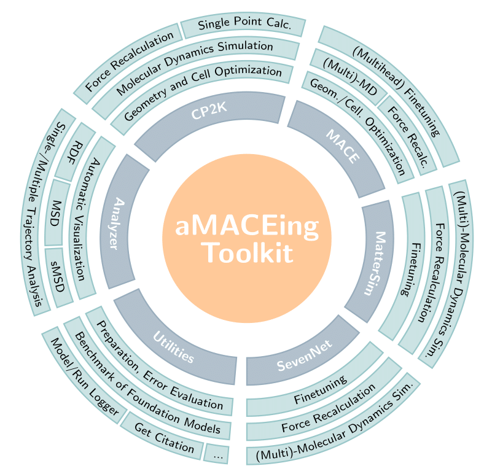

Workflow Overview
=================

aMACEing_toolkit offers a comprehensive workflow for molecular simulations, covering multiple stages from input generation to analysis. This document provides a high-level overview of the workflow components.

Core Workflow Components
------------------------

   Modules of aMACEing_toolkit

The toolkit consists of several integrated components:

1. Input Generation
-------------------

Multiple interfaces for creating input files for different simulation engines:

* **CP2K**: Quantum chemistry simulation software
* **MACE**: MLIP
* **MatterSim**: MLIP
* **SevenNet**: MLIP
* **ORB**: MLIP
* **Grace**: MLIP

Each input generator supports:

* Interactive Q&A sessions
* Direct command-line arguments
* Python API

2. Run Management
-----------------

The toolkit provides:

* Automatic generation of runscripts tailored to common HPC systems
* Run logging to track simulation parameters
* Model logging for machine learning model fine-tuning

3. Trajectory Analysis
----------------------

A comprehensive analysis toolkit for simulation outputs:

* **RDF**: Radial distribution function analysis for atomic structure characterization
* **MSD**: Mean square displacement for diffusion analysis
* **sMSD**: Single-particle mean square displacement for individual particle mobility
* **VACF**: Vector autocorrelation function for dynamics analysis
* Support for both single and multiple trajectory analysis
* Visualization and report generation capabilities

4. Model Training & Evaluation
------------------------------

Tools for machine learning interatomic potential finetuning and application:

* Dataset creation from reference trajectories
* Fine-tuning of foundation models for specific systems
* Multihead fine-tuning for MACE models
* Performance evaluation against reference data
* Benchmarking different models

Typical Workflow Examples
-------------------------

Example 1: Ab initio to ML Workflow
~~~~~~~~~~~~~~~~~~~~~~~~~~~~~~~~~~~

1. Generate CP2K input for ab initio MD (using ``amaceing_cp2k``)
2. Run quantum MD simulation with CP2K
3. Use the quantum trajectory to fine-tune a MACE model (using ``amaceing_mace``)
4. Generate MACE input for production MD (using ``amaceing_mace``)
5. Run long production MD with the fine-tuned model
6. Analyze results with the analyzer toolkit (using ``amaceing_ana``)

Example 2: Model Benchmarking
~~~~~~~~~~~~~~~~~~~~~~~~~~~~~

1. Create a reference dataset from CP2K simulations
2. Fine-tune multiple models or use just foundation models (MACE, MatterSim, SevenNet, ORB)
3. Evaluate and compare model performance (using ``amaceing_utils``)
4. Select the best model for production simulations

File Organization
-----------------

The toolkit organizes files in a logical structure:

* Input files are created in the current directory
* Runscripts are generated alongside input files
* Log files track simulation parameters
* Default configurations are stored in the package's default_configs directory
* Model parameters are tracked through the model logging system
* The performed production runs can be exported to a pdf report for easy sharing and documentation